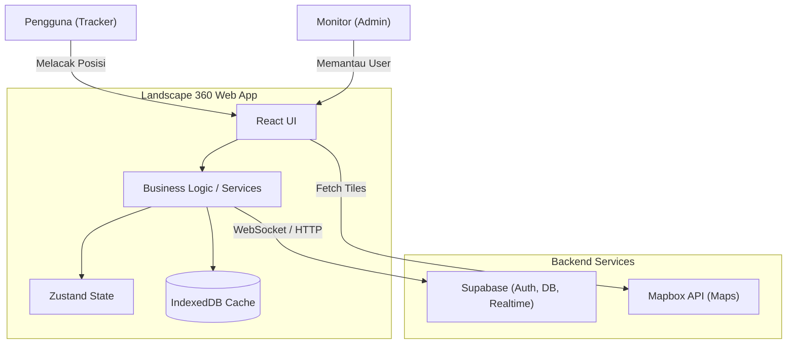
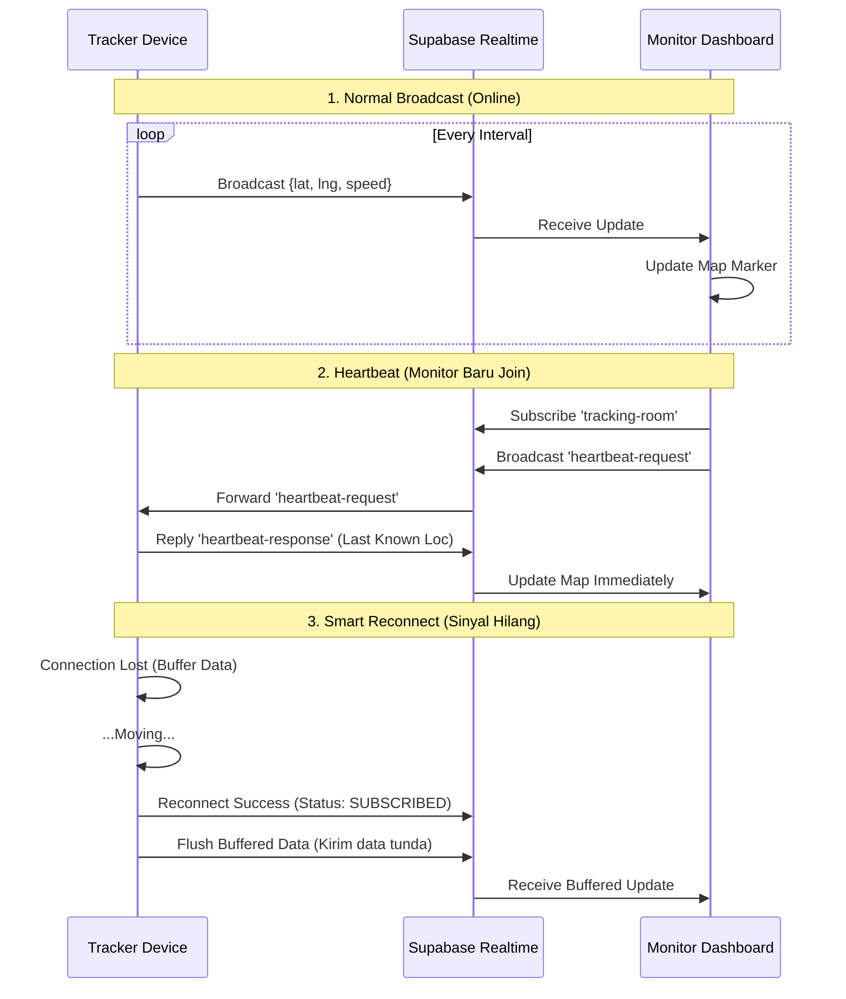
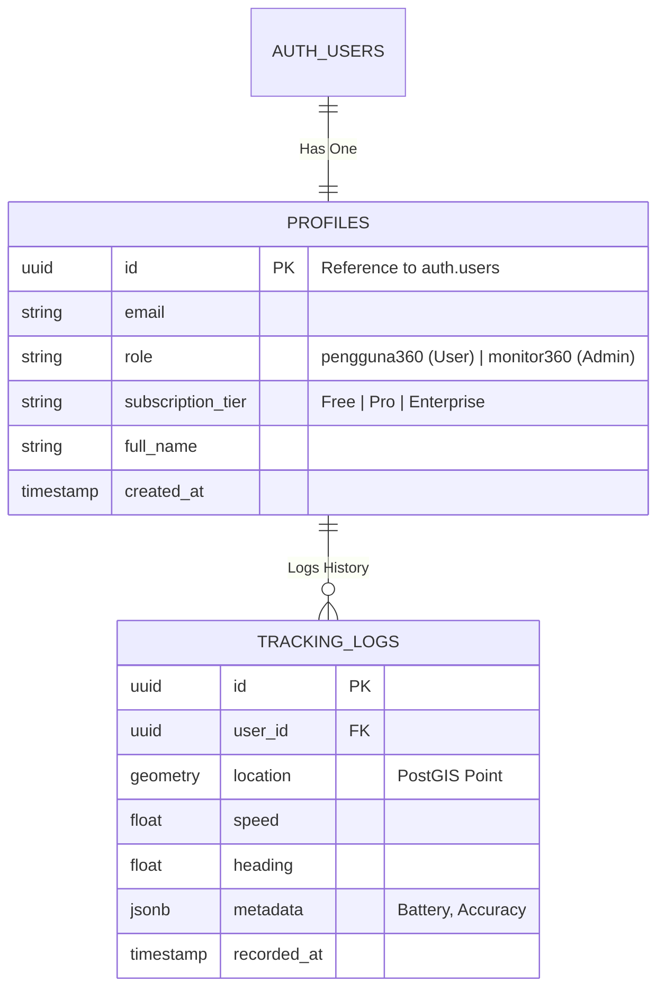

# Arsitektur Sistem Landscape 360

Dokumen ini menjelaskan arsitektur teknis dari aplikasi **Landscape 360**, sebuah platform pemetaan dan pelacakan GPS real-time.

## 1. Visualisasi Arsitektur (Diagram)

Berikut adalah representasi visual dari sistem menggunakan diagram Mermaid.

### A. Diagram Konteks Sistem (System Context)
Menggambarkan bagaimana pengguna berinteraksi dengan aplikasi dan layanan eksternal.

### B. Alur Data Tracking (Sequence Diagram)
Menjelaskan bagaimana data lokasi dikirim dari Tracker ke Monitor, termasuk mekanisme **Heartbeat** dan **Smart Reconnect**.

### C. Skema Database & Role (ER Diagram)
Struktur data untuk manajemen pengguna dan hak akses.

---

## 2. Detail Modul Teknis

### Tech Stack Utama
- **Frontend Framework**: React (TypeScript) + Vite
- **State Management**: Zustand
- **Map Engine**: Mapbox GL JS (`react-map-gl`)
- **Backend & Realtime**: Supabase (PostgreSQL, Auth, Realtime)
- **Styling**: Tailwind CSS

### A. Autentikasi & Role (RBAC)
Sistem menggunakan **Supabase Auth** dengan tingkatan akses berikut:

#### 1. Pengguna Tamu (Guest / Tanpa Login)
-   **Akses**: Terbatas.
-   **Fitur**:
    -   Melihat peta dasar (2D/3D).
    -   Mengubah gaya peta (Streets, Outdoors, Satellite).
    -   Navigasi dasar (Zoom, Pan, Rotate, Tilt).
-   **Batasan**: Tidak bisa menyimpan survey, tidak bisa download peta offline, tidak ada fitur tracking.

#### 2. Pengguna Free (`pengguna360`)
-   **Akses**: Login via Email.
-   **Fitur**:
    -   Menyimpan hingga **2 Survey**.
    -   Download peta offline (Max **1 Region**, **1 MB**).
-   **Batasan**: Fitur GPS Tracking **Dimatikan**.

#### 3. Pengguna Pro (`pengguna360` + Subscription)
-   **Akses**: Berlangganan bulanan ($3.5/mo).
-   **Fitur**:
    -   **GPS Broadcast**: Dapat mengirim lokasi diri sendiri ke server.
    -   Menyimpan hingga **4 Survey**.
    -   Download peta offline (Max **3 Regions**, **10 MB**).
    -   High-Res Export (PNG/PDF).
-   **Batasan**: Hanya bisa melihat lokasi diri sendiri, tidak bisa memantau user lain.

#### 4. Pengguna Enterprise (`monitor360`)
-   **Akses**: Lisensi Korporat ($7/mo).
-   **Fitur**:
    -   **Realtime Monitoring**: Melihat **SEMUA** user aktif di peta secara real-time.
    -   Akses ke **Control Panel** khusus.
    -   Menyimpan hingga **10 Survey**.
    -   Download peta offline (Max **10 Regions**, **25 MB**).
    -   Prioritas Support 24/7.

### B. Mode Konektivitas (Online vs Offline)
Fitur unggulan untuk menangani sinyal tidak stabil:

1.  **Online Mode (Realtime Tracking)**
    -   Menggunakan **WebSockets** untuk komunikasi dua arah.
    -   **Heartbeat Protocol**: Memastikan data langsung muncul saat monitor login.
    -   **Smart Reconnect**: Menyimpan data saat offline dan mengirimnya saat online kembali.

2.  **Offline Mode**
    -   **Map Caching**: Menggunakan **IndexedDB** untuk menyimpan tile peta.
    -   **Local Survey**: Data pengukuran disimpan di state lokal perangkat.

## 3. Struktur Direktori
- `/src/components`: Komponen UI (Map, ControlPanel, Auth).
- `/src/services`: Logika bisnis (TrackerService, MapService).
- `/src/store`: Global state (Zustand).
- `/src/utils`: Utilitas (Offline DB, Geometry calculations).
